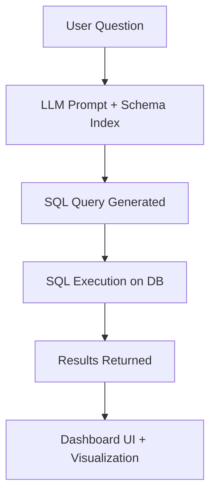

# 🚀 DASHRAG-HACKATHON  

  
  
  
  

🔍 **Ask questions in plain English → Get SQL queries → See results instantly**  

---

## ✨ Features  

- 🤖 **Natural Language → SQL** using Groq, OpenAI, HuggingFace, or Ollama  
- 📚 **Schema-aware RAG** powered by FAISS for grounded SQL generation  
- 🗄️ **SQLite or Postgres (configurable)** – SQLite is default in Docker  
- 📊 **Interactive Dashboard** to explore results & visualizations  
- 🐳 **Dockerized setup** with auto-migrations, staticfiles, and optional demo seeding  

---

## 📂 Project Structure  

```bash
hackathon_ai_dashboard/
├── manage.py
├── hackathon_ai_dashboard/        # Django settings & project config
├── core/
│   ├── models.py                  # User, Ticket, Bet models
│   ├── views.py                   # Dashboard view
│   ├── process.py                 # NL → SQL pipeline
│   ├── llm_loader.py              # Provider switcher
│   ├── query_generator.py         # LLM prompting logic
│   ├── management/commands/       # custom mgmt commands (e.g. seed_demo)
│   └── templates/dashboard.html   # UI template
├── docker-compose.yml
├── Dockerfile
├── entrypoint.sh
├── gunicorn.conf.py
└── requirements.txt
```

---

## ⚙️ How It Works  



---

## 🚀 Running with Docker  

### 🔑 Prerequisites  
- Docker  
- Docker Compose v1.22+  

### 📥 Setup & Run  

```bash
# Build and start containers
docker-compose up --build
```

Open the app → [http://localhost:8000/dashboard](http://localhost:8000/dashboard)

---

## 🛠️ Environment Variables  

Create a `.env` file in the project root (same dir as docker-compose.yml):

```ini
SECRET_KEY=change-me
DEBUG=true

# Optional: auto-seed demo data
DEMO_SEED=true
DEMO_SEED_COUNT=10000

# LLM Providers (set one or more)
GROQ_API_KEY=your_groq_key
OPENAI_API_KEY=your_openai_key
HUGGINGFACEHUB_API_TOKEN=your_hf_key
```

---

## 🧠 Switching LLM Provider  

Edit **`core/llm_loader.py`**:  

```python
model_type = "groq"      # or "openai" | "huggingface" | "ollama"
model_name = "llama3-70b-8192"
```

---

## 🧪 Demo Seeding  

We use **best practice seeding**:  
- `core/migrations/0002_seed_defaults.py` → minimal defaults, runs once.  
- `python manage.py seed_demo --count 10000` → bulk/demo seed (idempotent).  

In Docker, seeding runs automatically if you set:  

```ini
DEMO_SEED=true
DEMO_SEED_COUNT=10000
```

and the DB is empty.

---

## 🛡️ Security Notes  

- ⚠️ Only allow **SELECT queries** in production to avoid risky SQL execution.  
- Use proper `.env` secrets (never hardcode API keys).  
- For production, set `DEBUG=False` and generate a strong `SECRET_KEY`.  

---

## 🛠️ Deployment Notes  

- Default Docker setup uses **SQLite** (mounted volume).  
- For production, update `settings.py` + `docker-compose.yml` to use **Postgres**.  
- Gunicorn is used as the WSGI server (configured via `gunicorn.conf.py`).  

---

## 📜 License  

MIT / Apache 2.0 (choose your license)  

## Video description
https://drive.google.com/file/d/1vYvjM0AFIEJFwLUVYLCjMDeOrMIyPs0m/view?usp=sharing


## Example prompt that you can use
Show me top 10 users by win amount
Show me yesterday’s revenue by provider
Show me top 10 players by net revenue last week
Show all users and revenue generated by them
Show top 10 users by loss
